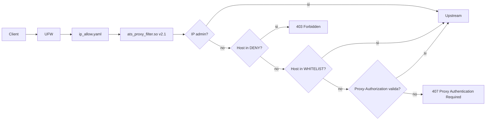

# ATS Proxy Enterprise

**Apache Traffic Server 9.2.13 — Proxy Outbound Enterprise con URL Filtering, Autenticazione e Hardening**

[](https://releases.ubuntu.com/24.04/)
[](https://releases.ubuntu.com/26.04/)
[](https://trafficserver.apache.org/)
[]()
[]()

## Cosa offre

Proxy HTTP/HTTPS enterprise con autenticazione integrata, URL filtering a 3 livelli, hardening completo e logging forense. Due VM di test (Ubuntu 24.04 e 26.04) con batteria test a 50 richieste concorrenti.

| Funzione | Dettaglio |
|----------|-----------|
| **Proxy forward** | HTTP + HTTPS CONNECT su porta 8080; TLS frontend opzionale su 8443 |
| **URL Filtering** | DENY (403), WHITELIST (pass), AUTH-GATED (407) |
| **Autenticazione** | Proxy-Authorization Basic con utenti da config file |
| **Admin bypass** | IP in whitelist saltano tutte le regole |
| **Hardening** | SSH key-only, fail2ban, UFW, systemd hardening, sysctl |
| **Logging** | Audit log con FQDN, IP, status — forwardabile a SIEM/ELK |
| **Monitoraggio** | Health check automatico, metriche traffic_ctl |
| **Plugin custom** | `ats_proxy_filter.so` v2.1 — binario recuperato/versionato, 50+ concorrenti testato |

## Principi fondanti

```yaml
1. Least Privilege      — utente dedicato ats, shell nologin, systemd hardening
2. Defense in Depth     — UFW → ip_allow.yaml → URL filter → Auth
3. Auditability         — ogni richiesta loggata, etckeeper per config
4. Data Minimization    — FQDN loggato, non URL completo. HTTPS tunnel cifrato
5. Resilience           — auto-restart, lock recovery, 50 req/s concorrenti
6. Secure by Default    — ATS 9.2.13 compilato da sorgente (11 CVE chiuse)
7. Encryption           — HTTPS end-to-end; TLS 1.3 frontend opzionale
8. Segregation of Duties— admin/operator/auditor via SSH key + sudo
9. Incident Response    — procedura documentata, notifica NIS2 24h/72h
10. Continuous Improvement — audit periodico, test regressione, CVE monitoring
```

## Quick Start

### Installazione automatizzata

```bash
# 1. Clona e prepara la configurazione locale
git clone https://github.com/tripersonale/ats-proxy-enterprise.git
cd ats-proxy-enterprise
cp env/ats-proxy.env.example ats-proxy.env
nano ats-proxy.env

# 2. Il plugin v2.1 recuperato dalle VM validate e in bin/ats_proxy_filter_v21.so

# 3. Verifica prima di installare
bash scripts/preflight.sh --env ats-proxy.env
sudo bash scripts/install-ats-proxy.sh --env ats-proxy.env --non-interactive --validate-only

# 4. Esegui installer
sudo bash scripts/install-ats-proxy.sh --env ats-proxy.env --non-interactive

# 5. Verifica base
curl -s -o /dev/null -w '%{http_code}\n' -x http://localhost:8080 http://httpbin.org/ip
```

Con la configurazione di esempio `httpbin.org` e in DENY list, quindi il risultato atteso e `403`. Per un test `200/301`, usare un dominio in whitelist come `google.com`.

Guida passo-passo: [`GUIDA_REPLICABILITA_DEPLOY_v1.0.md`](GUIDA_REPLICABILITA_DEPLOY_v1.0.md).

Se la VM non ha accesso alla repo privata GitHub, usare il flusso pacchetto `.tar.gz`: [`GUIDA_TRASFERIMENTO_VM_v1.0.md`](GUIDA_TRASFERIMENTO_VM_v1.0.md).

### Plugin URL Filtering + Auth

```bash
# Copia il plugin
sudo cp ats_proxy_filter.so /opt/trafficserver/lib/modules/

# Configura
sudo tee /etc/trafficserver/ats_proxy_filter.conf << 'EOF'
ADMIN 192.168.89.10
DENY httpbin.org
DENY bad.com
WHITELIST google.com
WHITELIST github.com
USER admin INSERIRE_PASSWORD_FORTE
USER user1 INSERIRE_PASSWORD_FORTE
EOF

sudo tee /etc/trafficserver/plugin.config << 'EOF'
ats_proxy_filter.so
EOF

sudo systemctl restart trafficserver

# Test
curl -x http://proxy:8080 http://httpbin.org/ip            # → 403 Forbidden
curl -x http://proxy:8080 http://google.com                 # → 301 (whitelist)
curl -x http://proxy:8080 http://wikipedia.org              # → 407 Auth Required
curl -x http://proxy:8080 --proxy-user admin:PASSWORD ...   # → 200 OK
```

Nota operativa: binario e sorgente C del plugin v2.1 sono versionati in `bin/ats_proxy_filter_v21.so` e `src/ats_proxy_filter_v21.c`.

## Architettura



## Documentazione

| Documento | Contenuto |
|-----------|-----------|
| [`GUIDA_INSTALLAZIONE_ATS_v3.0_UNIFICATA.md`](GUIDA_INSTALLAZIONE_ATS_v3.0_UNIFICATA.md) | Installazione completa Ubuntu 24.04 e 26.04 |
| [`GUIDA_PLUGIN_UNIFICATO_v2.1.md`](GUIDA_PLUGIN_UNIFICATO_v2.1.md) | Plugin URL filtering + auth config-based |
| [`GUIDA_REPLICABILITA_DEPLOY_v1.0.md`](GUIDA_REPLICABILITA_DEPLOY_v1.0.md) | Deploy ripetibile da GitHub + env locale + plugin |
| [`GUIDA_TRASFERIMENTO_VM_v1.0.md`](GUIDA_TRASFERIMENTO_VM_v1.0.md) | Repo privata scaricata su PC, pacchetto tar.gz e installazione su VM |
| [`TEST_MATRIX.md`](TEST_MATRIX.md) | Stato verifiche locali, VM reali e gap da validare |
| [`ARTIFACTS.md`](ARTIFACTS.md) | Manifest artefatti: plugin binario, hash, provenienza, gap sorgente |
| [`CHANGELOG.md`](CHANGELOG.md) | Versioni e modifiche del progetto |
| [`ROOT_CAUSE_REPLICABILITA_v1.0.md`](ROOT_CAUSE_REPLICABILITA_v1.0.md) | Perche mancava il plugin in repo e come evitarlo |
| [`scripts/ats-regression-test.sh`](scripts/ats-regression-test.sh) | Batteria test proxy automatica (DENY, WHITELIST, AUTH, concorrenti) |
| [`scripts/ats-version-report.sh`](scripts/ats-version-report.sh) | Report versioni OS, ATS, plugin, service e config |
| [`GUIDA_UPGRADE_CVE_v1.0.md`](GUIDA_UPGRADE_CVE_v1.0.md) | Upgrade ATS, gestione CVE, compatibilità |
| [`GUIDA_OPERATIVA_ATS_v1.0.md`](GUIDA_OPERATIVA_ATS_v1.0.md) | Operazioni quotidiane, debug, compliance GDPR |
| [`GUIDA_LOG_SIEM_v1.0.md`](GUIDA_LOG_SIEM_v1.0.md) | Log forwarding a syslog/ELK |
| [`GUIDA_CONCETTUALE_ATS_v1.0.md`](GUIDA_CONCETTUALE_ATS_v1.0.md) | Come funziona ATS, architettura, ACL |
| [`MANIFESTO_PRINCIPI_v1.0.md`](MANIFESTO_PRINCIPI_v1.0.md) | 10 principi, mappatura NIS2/GDPR/ISO 27001 |
| [`AUDIT_SICUREZZA_COMPLIANCE_v1.0.md`](AUDIT_SICUREZZA_COMPLIANCE_v1.0.md) | 42 gap identificati e risolti |

Documenti storici mantenuti per tracciabilita: `archive/storico/`.

## VM di test

| VM | OS | IP | Plugin |
|----|----|----|--------|
| **130** | Ubuntu 24.04.4 LTS | 192.168.89.27 | v2.1 |
| **134** | Ubuntu 26.04 LTS | 192.168.89.28 | v2.1 |

## Stack tecnico

```
ATS 9.2.13 (compilato da sorgente)
├── Porta 8080 (HTTP)
├── Porta 8443 opzionale (TLS 1.3 frontend, CONNECT)
├── Plugin: ats_proxy_filter.so v2.1 (OS_DNS hook, binario versionato)
├── Firewall: UFW + ip_allow.yaml
├── Hardening: SSH key-only, fail2ban, systemd, sysctl
├── Logging: audit.log → rsyslog/Filebeat → ELK/SIEM
├── Backup: etckeeper (git su /etc)
└── Monitor: health check cron, traffic_ctl metrics
```

## Requisiti

- Ubuntu Server 24.04 LTS o 26.04 LTS
- 2+ GB RAM, 10+ GB disco
- GCC, OpenSSL, PCRE1 (da apt su 24.04, da sorgente su 26.04)

## Licenza

**FEL-1.0 — Fair Enterprise License v1.0** ([`LICENSE.md`](LICENSE.md))

Fair source, non open source (OSI). Basata su BSL-1.1 (MariaDB).

- Uso, modifica, consulenza, MSP, hosting gestito → **gratis**, con attribuzione
- Vendere il software come prodotto/SaaS/fork commerciale → **serve accordo** (25% royalty alla fondazione)
- Contributori (CLA firmato) → **10%** invece del 25%
- Piccole imprese (< 500 k€/anno) → **esenti** da royalty
- Dopo 4 anni dalla release → diventa automaticamente **Apache 2.0**

Spiegazione in italiano: [`LICENSE.plain.md`](LICENSE.plain.md)

Accordo contributori: [`CLA.md`](CLA.md)

⚠️ **REVISIONE LEGALE PENDENTE**: la licenza va verificata da un legale italiano prima dell'uso in contesti commerciali. Tripersonale Onlus (da costituire) sarà l'entità beneficiaria delle royalty.

---

*Progetto creato il 24 Maggio 2026. Ultimo aggiornamento: 26 Maggio 2026.*
